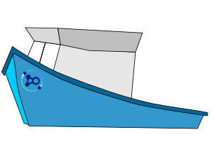

# trawler




Trawler is a metrics exporter for IBM API Connect.

## Deployment

Trawler is designed to run within the same kubernetes cluster as API Connect, such that it can scrape metrics from the installed components and make them available. The metrics gathering in Trawler is separated into separate nets for the different types of metrics to expose so you can select which ones to enable for a particular environment.

It requires a service account with read access to list pods and services in the namespace(s) the API Connect components are deployed in.

[More details on installing trawler](docs/install.md)

### Configuring trawler

Trawler gets its config from a mounted configmap containing config.yaml which looks like this:

```yaml
trawler:
  frequency: 10
  use_kubeconfig: false
prometheus:
  port: 63512 
  enabled: true
logging: 
  level: debug
  filters: trawler:trace
  format: pretty
nets:
  datapower:
    enabled: true
    username: trawler-monitor
    namespace: apic-gateway
  product:
    enabled: true
    username: trawler-monitor
    namespace: apic-management
```
**General trawler settings:**
 - frequency: number of seconds to wait between trawling for metrics
 - use_kubeconfig: use the current kubeconfig from the environment instead looking at _in cluster_ config
 - logging: set the default logging level, output format and filters for specific components 
**Prometheus settings:**
The port specified in the prometheus block needs to match the prometheus annotations on the deployed trawler pod for prometheus to discover the metrics exposed.  

**Individual nets**
Each of the different areas of metrics is handled by a separate net, which can be enabled/disabled independently.  The configuration for these is currently a pointer to the namespace the relevant subsystem is deployed into and a username to use.  Passwords are loaded separately from the following values in a kubernetes secret mounted at the default location of `/app/secrets` - which can be overridden using the SECRETS environment variable:

 - datapower_password - password to use with the datapower net for accessing the [DataPower REST management](https://www.ibm.com/support/knowledgecenter/SS9H2Y_7.7.0/com.ibm.dp.doc/restmgtinterface.html) interface. 
 - cloudmanager_password - password to use with the manager net to retreive API Connect usage metrics.

## Issues, enhancements and pull requests

Feature requests and issue reports are welcome as [github issues](https://github.com/IBM/apiconnect-trawler/issues) through this repository.  Contributions of pull requests are also accepted and should be provided with a linked issue explaining the reasoning behind the change, should follow the existing code format standards and tests should be included in the PR ensuring the overall code coverage is not reduced. 

## More documentation

 - [Metrics gathered by trawler](docs/metrics.md)
 - [Install](docs/install.md)
 - [Frequently asked questions](docs/faq.md)


## Development tips

### Setting up your development environment

Install the pre-reqs for trawler from requirements.txt and development and testing requirements from requirements-dev.txt

    pip install -r requirements.txt
    pip install -r requirements-dev.txt

Initialise the pre-commit checks for Trawler using [pre-commit](https://pre-commit.com/)

    pre-commit install

### Running test cases locally

Trawler uses py.test for test cases and the test suite is intended to be run with the test-assets directory as the secrets path.

    SECRETS=test-assets coverage run --source . -m py.test


### Running locally

To run locally point the config parameter to a local config file

    python3 trawler.py --config local/config.yaml

You can view the data that is being exposed to prometheus at [localhost:63512](http://localhost:63512) (or the custom port value if it's been changed)


Notes on developing with a running k8s pod:

    kubectl cp datapower_trawl.py {trawler_pod}:/app/datapower_trawl.py
    kubectl cp newconfig.yaml {trawler_pod}:/app/newconfig.yaml
    kubectl exec {trawler_pod} -- sh -c 'cd /app;python3 trawler.py -c newconfig.yaml'
