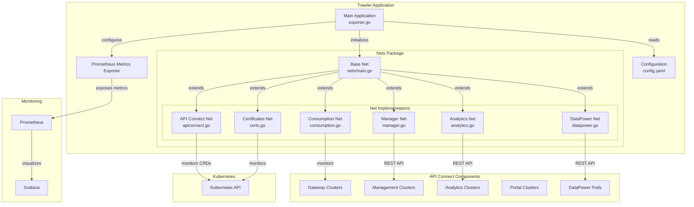

# API Connect Trawler Architecture Overview

Based on analysis of the codebase, this document provides a comprehensive architecture overview of the apiconnect-trawler project to help understand how the different components interact and how metrics are collected and exposed.

## Architecture Diagram

## Component Descriptions

### Main Application (exporter.go)

The main application is responsible for:

- Reading configuration from config.yaml
- Initializing and configuring the different "nets" based on configuration
- Setting up the HTTP server to expose metrics endpoints
- Managing the lifecycle of the application

### Nets Package (nets/main.go)

The nets package provides core functionality for:

- Interacting with Kubernetes API
- Making authenticated API calls to API Connect components
- Defining the base structure for all net implementations
- Providing utility functions for Kubernetes client creation and configuration

### Net Implementations

Each net is responsible for collecting specific metrics from different components of API Connect:

1. **API Connect Net (apiconnect.go)**
   - Monitors the status of API Connect Custom Resource Definitions (CRDs)
   - Collects health metrics for API Connect subsystems
   - Exposes metrics like `apiconnect_gatewaycluster_status`, `apiconnect_managementcluster_status`, etc.

2. **DataPower Net (datapower.go)**
   - Connects to DataPower gateways via REST Management API
   - Collects detailed metrics about TCP connections, log targets, analytics endpoints, etc.
   - Performs API tests to measure response times and status codes
   - Exposes metrics like `datapower_tcp_established_total`, `datapower_logtarget_events_processed`, etc.

3. **Analytics Net (analytics.go)**
   - Connects to Analytics components via REST API
   - Collects metrics about cluster health, shards, API calls, etc.
   - Exposes metrics like `analytics_cluster_status`, `analytics_active_shards_total`, etc.

4. **Manager Net (manager.go)**
   - Connects to Management components via REST API
   - Collects metrics about users, organizations, catalogs, products, etc.
   - Exposes metrics like `manager_users_total`, `manager_provider_orgs_total`, etc.

5. **Consumption Net (consumption.go)**
   - Monitors API consumption metrics for high level insight to health.

6. **Certificates Net (certs.go)**
   - Monitors certificate expiration dates
   - Exposes metrics like `cert_remaining_seconds`

### Prometheus Metrics Exporter

The Prometheus Metrics Exporter:

- Exposes all collected metrics in Prometheus format
- Provides endpoints for Prometheus to scrape
- Handles metric registration and updates

## Data Flow

1. Trawler is deployed in the same Kubernetes cluster as API Connect
2. Each net is initialized based on configuration
3. Nets periodically collect metrics from their respective components:
   - Via Kubernetes API for CRD status
   - Via REST APIs for component-specific metrics
4. Metrics are registered with Prometheus client library
5. Prometheus scrapes the metrics endpoint
6. Grafana visualizes the metrics

## Configuration

Trawler is configured via a config.yaml file that specifies:

- General settings like polling frequency
- Prometheus configuration
- Logging configuration
- Individual net configurations (enabled/disabled, credentials, namespaces, etc.)

Sensitive information like passwords is stored in Kubernetes secrets and mounted into the container.

## Deployment

Trawler is deployed as a Kubernetes deployment with:

- ConfigMap for configuration
- Secrets for credentials
- ServiceAccount with appropriate permissions to access API Connect components
- Service for exposing metrics endpoint
- NetworkPolicy for controlling access

## Key Features

1. **Modular Design**: Each net can be enabled/disabled independently
2. **Kubernetes Native**: Designed to run within Kubernetes and leverage its APIs
3. **Comprehensive Metrics**: Collects metrics from all API Connect components
4. **Prometheus Integration**: Exposes metrics in Prometheus format
5. **Low Overhead**: Efficient polling and caching mechanisms
6. **Secure**: Uses appropriate authentication for each component

This architecture allows trawler to efficiently collect metrics from all components of IBM API Connect and expose them in a standardized format for monitoring and alerting.